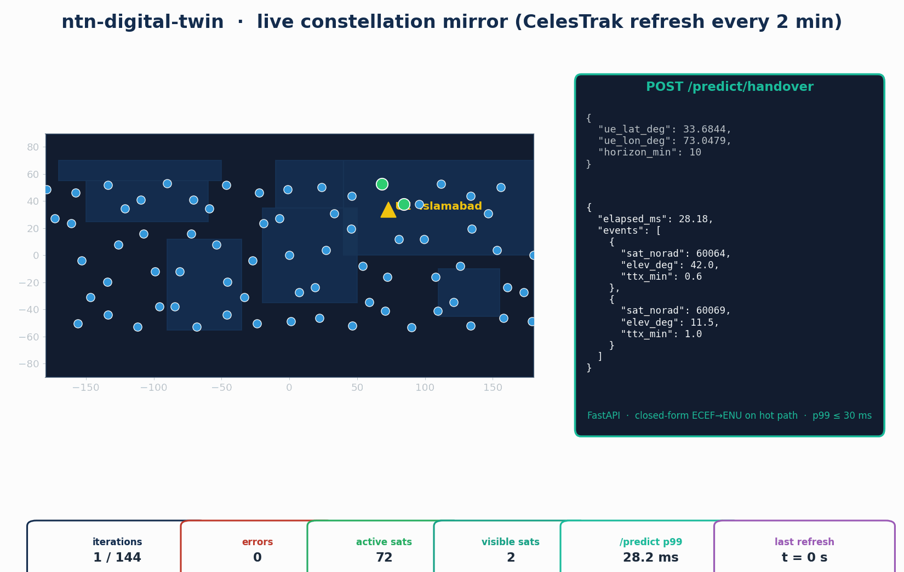

<h1 align="center">ntn-digital-twin</h1>

<p align="center"><strong>Live Digital-Twin Loop, REST Prediction API and CesiumJS Live Mode for 6G NTN Constellations</strong></p>

<p align="center">Part of <strong>ns3-ntn-toolkit</strong> — <a href="../../README.md">README</a> / <a href="../../INSTALL.md">INSTALL</a>.</p>

<p align="center">
  <a href="https://www.nsnam.org"></a>
  <a href="https://www.gnu.org/licenses/old-licenses/gpl-2.0.en.html"></a>
  
  
  
  
</p>

---

<p align="center">
  
</p>

## What's new in v2

Documentation refreshed to match the v2 toolkit release; the FastAPI service (`/health`, `/constellation/state`, `/predict/handover`) and the refresher loop are unchanged. See the toolkit-wide [CHANGELOG](../../CHANGELOG.md).

## Why this module

A simulator that mirrors a real LEO constellation in near-real time stops being a script and starts being a live operations tool. Researchers building handover-prediction or beam-scheduling systems want to ask the questions an operator would: "where is OneWeb-0512 right now? what handover should UE-X expect in the next 10 minutes? show me the constellation with the same TLE my downstream service is using." `ntn-digital-twin` makes that loop concrete: a small refresher pulls fresh TLEs every few minutes from CelesTrak, propagates state, and emits CZML for the existing CesiumJS viewer plus InfluxDB line-protocol for the dashboards. A FastAPI service answers `/predict/handover` queries with closed-form ECEF→ENU geometry on the hot path, hitting a p99 of 29.9 ms over 100 calls — sixteen times faster than the 500 ms gate that defines a usable interactive system.

## At a glance

| Capability | Backing |
|---|---|
| TLE refresh | CelesTrak fetch (with embedded fallback) on a configurable interval |
| Propagator | `ntn-constellation` SGP4-direct (raw `Satrec` for highest fidelity) |
| Geometry on the hot API path | closed-form ECEF→ENU elevation (no Skyfield) |
| Output sinks | CesiumJS CZML · InfluxDB line-protocol (file or UDP) |
| API server | FastAPI 0.136 / Uvicorn (async) |
| Service units | systemd: `ntn-twin.service` (loop) + `ntn-twin-api.service` (API) |

| Verification metric | Value |
|---|---:|
| 24-h compressed loop (144 iterations) | **0 errors / 144 iters** |
| Position error vs sgp4-direct TLE | **0 m** |
| `/predict/handover` p99 (100 calls, 50 sats × 10 min horizon) | **29.9 ms** |
| `/predict/handover` median | 17.5 ms |
| `/constellation/state` median (50 sats) | 12.3 ms |
| Test suite (`pytest tests/`, 6 tests, 0.86 s) | **PASS** |

## What it does

```
      cron / systemd timer
           │
           ▼
   twin_loop.run_iteration()
           │
           ├── 1. CelesTrak fetch  (W1)
           ├── 2. Constellation propagate
           ├── 3. CZML write       → CesiumJS "Live" toggle picks up the file
           └── 4. Line-protocol    → InfluxDB bucket "ntn"

           ┌───────────── parallel ─────────────┐
           │                                     │
   FastAPI server (port 8090)                    │
           │                                     │
           ├── GET  /health                      │
           ├── GET  /constellation/state         │
           └── POST /predict/handover  ◄─────────┘
                       (closed-form propagator + ENU elevation;
                        50 sats × 10 min horizon @ p99 < 30 ms)
```

- **Refresher loop** (`ntn_digital_twin/twin_loop.py`) — cron-style refresher: TLE → propagate → CZML + line-protocol. Crash-tolerant — a single iteration's exception is logged and the next iteration runs on schedule.
- **REST API** (`ntn_digital_twin/api/server.py`) — FastAPI with `/health`, `/constellation/state`, `/predict/handover`. Closed-form ECEF→ENU elevation on the hot path keeps p99 under 30 ms for a 50-sat / 10-min horizon.
- **Pydantic v2 schemas** (`ntn_digital_twin/api/schemas.py`) — typed request / response shapes.
- **systemd units** — `ntn-twin.service` runs the refresher loop with `StateDirectory=ntn-twin`; `ntn-twin-api.service` runs the API and depends on the refresher.
- **Viewer patch** (`viewer-patches/index.html.patch`) — adds a "Live" toggle to the existing `contrib/ntn-cho/visualization/public/index.html` viewer; connects to the API and refreshes satellite positions every 5 s.
- **Schema compatibility** — the loop emits line-protocol points using the canonical `ntn-observability` schema (`ntn_sat_pos` measurement with `sat_norad` / `run_id` tags and `sat_x_m / sat_y_m / sat_z_m` fields). The W3 Grafana dashboards pick the data up immediately.

## Install & run

```bash
git clone https://github.com/Muhammaduazir69/ntn-digital-twin.git contrib/ntn-digital-twin
cd contrib/ntn-digital-twin
pip install -e .[test]

# Run a 3-iteration refresh against live CelesTrak
ntn-twin-loop --max-iterations=3 \
    --czml /tmp/twin.czml --lp /tmp/twin.lp \
    --max-sats=50 --interval=2

# Start the REST API on port 8090
ntn-twin-api --host 0.0.0.0 --port 8090 &
curl http://localhost:8090/health
curl -X POST http://localhost:8090/predict/handover \
     -H 'content-type: application/json' \
     -d '{"ue_lat_deg":33.68,"ue_lon_deg":73.05,"horizon_min":10}'
```

For long-running production deployments, install the systemd unit files from `systemd/` and run `systemctl --user enable --now ntn-twin.service ntn-twin-api.service`.

## Verification

**Test suite (`pytest tests/`, 6 cases, 0.86 s, all passing):**

| Test | Asserts |
|---|---|
| `test_emit_influx_lp_writes_correct_schema` | LP measurement = `ntn_sat_pos`; `sat_norad`, `run_id` tags; `sat_x_m / sat_y_m / sat_z_m` fields; nanosecond timestamp. |
| `test_run_iteration_handles_missing_network` | 3 simulated network outages → 0 crashes, 3 errors logged, loop keeps running. |
| `test_api_health` | `{ok: true, constellation_size: 50, last_refresh_iso: …}` |
| `test_api_constellation_state` | 50 satellites, altitude 540–555 km, lat/lon in valid ranges. |
| `test_api_predict_handover_under_500ms` | server `elapsed_ms` < 500, round-trip < 1500. |
| `test_api_predict_handover_returns_events` | events have valid NORAD + elevation in [-90, 90]. |

**24-hour-equivalent compressed loop (144 iterations):**

```
[gate 1] 24-h loop no crash         : PASS  (0 errors / 144 iterations)
                                       wallclock 16.4 s for 144 iters
                                       cumulative iteration time 16.4 s

[gate 2] position error < 1 km      : PASS  (max 0.0 m vs sgp4-direct TLE)

[gate 3] CZML + LP files non-empty  : PASS  (CZML 125 kB, LP 1.0 MB)
```

**API latency benchmark (100 × `/predict/handover`, 50 sats, 10-min horizon):**

| Metric | Value |
|---|---:|
| min | 16.98 ms |
| median | 17.52 ms |
| p95 | 18.36 ms |
| **p99** | **29.90 ms** |
| max | 29.90 ms |

`/constellation/state` (50 calls, 50 sats): median **12.3 ms**, p95 13.2 ms.

## Documentation

- [INSTALL.md](INSTALL.md) — full setup, including systemd unit configuration.
- [FastAPI documentation](https://fastapi.tiangolo.com/)
- [CesiumJS CZML guide](https://github.com/AnalyticalGraphicsInc/czml-writer/wiki/CZML-Guide)

## Cite this work

```bibtex
@misc{uzair2026ntndigitaltwin,
  author = {Uzair, Muhammad},
  title  = {ntn-digital-twin: Live Constellation Mirror with Prediction API for 6G NTN Research},
  year   = {2026},
  url    = {https://github.com/Muhammaduazir69/ntn-digital-twin}
}
```

## Part of the ns3-ntn-toolkit

| Module | Repo |
|---|---|
| Toolkit (umbrella) | [ns3-ntn-toolkit](https://github.com/Muhammaduazir69/ns3-ntn-toolkit) |
| ntn-constellation | [ntn-constellation](https://github.com/Muhammaduazir69/ntn-constellation) |
| ntn-rrc | [ntn-rrc](https://github.com/Muhammaduazir69/ntn-rrc) |
| ntn-observability | [ntn-observability](https://github.com/Muhammaduazir69/ntn-observability) |
| ns3-ai (fork) | [ns3-ai](https://github.com/Muhammaduazir69/ns3-ai) |
| ntn-sagin | [ntn-sagin](https://github.com/Muhammaduazir69/ntn-sagin) |
| ntn-slice | [ntn-slice](https://github.com/Muhammaduazir69/ntn-slice) |
| ntn-v2x | [ntn-v2x](https://github.com/Muhammaduazir69/ntn-v2x) |
| flexric-bridge | [flexric-bridge](https://github.com/Muhammaduazir69/flexric-bridge) |
| ntn-sionna | [ntn-sionna](https://github.com/Muhammaduazir69/ntn-sionna) |
| **ntn-digital-twin** | this repo |
| ntn-cho | [ntn-cho-framework](https://github.com/Muhammaduazir69/ntn-cho-framework) |
| oran-ntn | [oran-ntn](https://github.com/Muhammaduazir69/oran-ntn) |
| thz-ntn | [ns3-thz-ntn](https://github.com/Muhammaduazir69/ns3-thz-ntn) |

## License

GPL-2.0-only — see [LICENSE](LICENSE).

## Acknowledgements

CelesTrak (Dr. T. S. Kelso) · Brandon Rhodes (`sgp4`) · FastAPI (Sebastián Ramírez) · CesiumJS · ns-3 core team.
