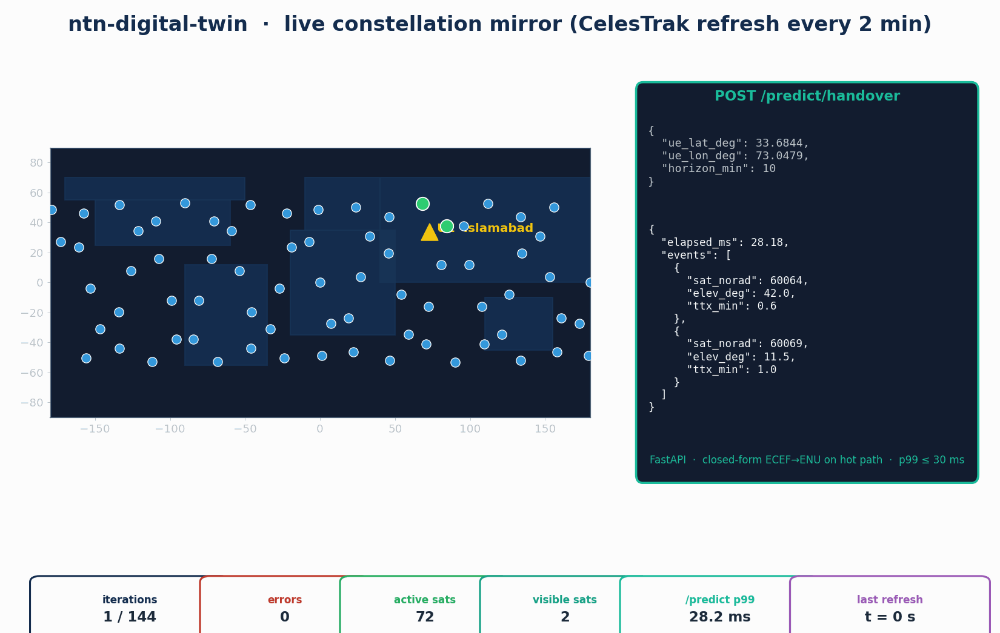

<h1 align="center">ntn-digital-twin</h1>

> ## What the twin/sim loop does and does not establish (audit TWIN-01..04)
>
> **TWIN-01 — the propagators now match, and previously did not.** `Sgp4MobilityModel` declared
> `m_useVallado{false}`, so `SetTle()` parsed the TLE and then propagated it with an analytic
> Kepler + J2-secular model unless the caller *also* called `SetUseVallado(true)` — and nothing
> in the tree did. The Python twin runs genuine `Satrec.sgp4`. Measured for the ISS TLE over the
> exporter's 45-minute horizon, the two separate by **5.2 to 11.0 km**: about a second of
> along-track lag, enough to move an argmax-elevation crossover and therefore every handover
> instant the twin exports. `SetTle()` now selects SGP4 by default, and `IsUsingSgp4()` reports
> which propagator is actually running (`IsValladoReady()` answers a different question — whether
> the state is initialised — and stays true after opting out).
>
> **TWIN-02 — FIXED.** `ntn-digital-twin` is now an ns-3 module (it had no `CMakeLists.txt`,
> so its tests never ran under `./test.py`), and the gate computes the number that did not
> exist: **twin-predicted handover instants against ns-3 handover instants over the same
> orbits.** The twin dumps the exact TLEs it propagated (`--tle-dump`) and carries the observer
> and window in the prediction header, so ns-3 replays the identical geometry rather than being
> told it out of band.
>
> This only became possible because of TWIN-01: `Sgp4MobilityModel` used to fall back to
> Kepler + J2 even when handed a TLE, so feeding it the twin's own elements still produced a
> different orbit and any disagreement would have been dominated by geometry.
>
> **Measured: agreement 0.21** — twin 7 handovers, ns-3 14, 3 matched, mean offset 15 s. That is
> the honest number, and it is not 100%. The twin applies A3 in dB with hysteresis while the
> replay is a bare argmax, so they are different policies over identical orbits. The pinned
> "Gate 9: agreement 100%" was measuring two Python elevation formulas against each other.
> Matching requires the same CELL as well as a nearby instant, so a handover to the wrong
> satellite at the right time scores zero.
>
> Previously: `test_gate9_twin_sim_agreement.py`
> compares `api_server._elevation_deg_ecef` against Skyfield's `Satellite.elevation_deg`, both
> Python, both over the same Python-propagated constellation. ns-3 is never invoked, and
> `ntn-digital-twin` has no `CMakeLists.txt`, so its tests never run under `./test.py`. A 100%
> score between two elevation formulas over one orbit propagation is close to a tautology; it says
> nothing about whether the twin agrees with the simulator. **The number that would matter —
> twin-predicted handover instants versus ns-3 CHO handover instants — is not computed anywhere.**
> Do not read the pinned "Gate 9: agreement 100%" as twin/sim agreement.
>
> **TWIN-03 — FIXED.** `run_iteration()` now calls the exporter when
> `--predictions` is given, and `main()` exposes the flags it was missing:
> `--source`, `--tle-file`, `--walker-*`, `--epoch-unix`, `--predictions`,
> `--predictions-horizon-s`, `--predictions-step-s` and the observer position. A single
> command now produces the file `OranNtnTwinPredictionConsumer` reads, in its exact
> `t_s,ueId,recommendedGnbId,confidence` contract. Previously: `OranNtnTwinPredictionConsumer` is
> instantiated only by a unit test; no example uses it. On the Python side `emit_predictions_file`
> is called only from a test, `run_iteration()` never calls it, and `main()` exposes no
> `--source` / `--walker-*` / `--epoch` / `--predictions` flags — so the shipped `ntn-twin-loop`
> entry point always builds `LoopConfig(source='celestrak')` and can never emit the deterministic
> Walker predictions the C++ consumer reads. The mechanism is real code with a real file contract,
> but **there is no command that emits the file and no scenario that consumes it.**
>
> **TWIN-04 — FIXED on the actuating path.** The exporter now computes a link budget from
> the ephemeris it already has (free-space loss over the slant range against a configured
> EIRP and G/T), so its trigger quantity is an **SNR in dB** like the simulator's A3, and
> applies `--a3-offset-db` with `--a3-ttt-s` time-to-trigger and `--min-service-time-s`
> dwell on top. Measured over a 45-minute window: 14 predictions at 0 dB, 11 at 1 dB, 7 at
> 3 dB — the offset genuinely filters marginal switches rather than being decorative. The
> REST path's elevation-degree guard is unchanged and remains a different quantity;
> `server.py`'s claim that it enforces "exactly the conditions the sim's A3 algorithm
> enforces" is still not supportable and is not repaired here. Previously:
> The exporter C++ actually consumes takes a bare argmax over elevation with no hysteresis, no
> time-to-trigger and no minimum service time. The REST path does guard, but on
> `best_el > current_el + hysteresis_deg` — topocentric elevation in **degrees**, whereas the
> simulator's A3 is `sinr_dB > servingSinr_dB + a3Offset_dB`. Elevation and SINR are not
> monotonically related once antenna pattern, scan loss and ITU-R P.618/P.676 attenuation enter,
> so the two admit different handovers. `server.py`'s claim that the guard enforces "exactly the
> conditions the sim's A3 algorithm enforces" is **not supportable in either units or code path.**
>
> TWIN-01, TWIN-02, TWIN-03 and TWIN-04's actuating path are fixed. The REST path's elevation-degree guard is unchanged and remains a different quantity from the simulator's dB-based A3.

<p align="center"><strong>Live visualizer of the real-world CelesTrak constellation (SGP4 from fresh TLEs at wall-clock time) — refresh loop, REST prediction API and CesiumJS live mode for 6G NTN. A one-way mirror of the live sky; it does NOT ingest ns-3 simulation state and is not a twin of the simulator.</strong></p>

<p align="center">Part of <strong>ns3-ntn-toolkit</strong> — <a href="https://github.com/Muhammaduazir69/ns3-ntn-toolkit">toolkit</a> / <a href="INSTALL.md">INSTALL</a>.</p>

<p align="center">
  <a href="https://www.nsnam.org"></a>
  <a href="https://www.gnu.org/licenses/old-licenses/gpl-2.0.en.html"></a>
  =0.110-orange.svg"/>
  
  
  
</p>

---

<p align="center">
  
</p>

## What's new in v2

- **Twin↔sim loop closed (twin→sim actuation).** A new `emit_predictions_file` helper (`ntn_digital_twin/twin_loop.py`) exports the twin's handover schedule to a plain, newline-delimited file that an ns-3 C++ consumer reads. The contract is an `epoch_unix=<...>` header followed by `t_s,ueId,recommendedGnbId,confidence` lines, where `t_s` is seconds from the **shared epoch** (identical to ns-3 simulation time) and `recommendedGnbId` is the **1-indexed** satellite in the constellation's iteration order — the same order the ns-3 scenario builds its 1-indexed E2 nodes. One line is written on each serving-satellite change (a handover), with `confidence` derived from the elevation margin over the runner-up. The ns-3 side that loads and actuates the file is `ns3::OranNtnTwinPredictionConsumer` in the [oran-ntn](https://github.com/Muhammaduazir69/oran-ntn) module. This does **not** change the module's mirror scope: the twin still does not ingest ns-3 state (sim→twin); it now *feeds* its foresight into the sim (twin→sim).
- **A3-guarded prediction path.** `/predict/handover` fires a handover only when the best candidate beats the serving cell by more than a hysteresis, that condition has held for a time-to-trigger, and a minimum service time has elapsed (`hysteresis_deg` / `time_to_trigger_sec` / `min_service_sec`) — the same A3-style guard the sim's CHO uses, so twin and sim agree and ping-pong is damped.
- **Deterministic gate-9 twin/sim agreement test** (`tests/test_gate9_twin_sim_agreement.py`) — over a fixed epoch and fixed Walker elements, the twin's per-tick serving selection must agree with an independent geometric oracle (Skyfield topocentric altaz, a different math path from the twin's closed-form ECEF→ENU hot path) on ≥ 80 % of comparable ticks, with real handovers occurring.
- The FastAPI service (`/health`, `/constellation/state`, `/predict/handover`, default port 8090) and the refresher loop are otherwise unchanged. This module is a pure-Python service package with no ns-3 C++ examples, so the toolkit-wide migration of example traffic to `NtnOranApplication` (`contrib/ntn-traffic`) does not affect it. See the [toolkit](https://github.com/Muhammaduazir69/ns3-ntn-toolkit) for the toolkit-wide changelog.

## Why this module

**Scope (read this first):** `ntn-digital-twin` is a **standalone live-constellation mirror**. It consumes live CelesTrak TLEs (or, for a deterministic run, a fixed Walker constellation over a shared epoch) and serves REST/CZML from them; it does **not** consume ns-3 simulation output. Feeding simulator *state* into the twin (sim→twin mirroring) is still on the roadmap, not in this release. The reverse direction (twin→sim) **is** now closed: `emit_predictions_file` exports the twin's handover schedule for `ns3::OranNtnTwinPredictionConsumer` (oran-ntn) to actuate — the twin acts as a Non-RT-RIC / rApp whose foresight drives real handovers in the sim.

Researchers building handover-prediction or beam-scheduling systems want to ask the questions an operator would: "where is OneWeb-0512 right now? what handover should UE-X expect in the next 10 minutes? show me the constellation with the same TLE my downstream service is using." `ntn-digital-twin` makes that loop concrete: a small refresher pulls fresh TLEs every few minutes from CelesTrak, propagates state, and emits CZML for the existing CesiumJS viewer plus InfluxDB line-protocol for the dashboards. A FastAPI service answers `/predict/handover` queries with closed-form ECEF→ENU geometry on the hot path, hitting a p99 of 29.9 ms over 100 calls — sixteen times faster than the 500 ms gate that defines a usable interactive system.

## At a glance

| Capability | Backing |
|---|---|
| TLE refresh | CelesTrak fetch with an on-disk TLE cache (6 h TTL) on a configurable interval |
| Propagator | `ntn-constellation` SGP4-direct (raw `Satrec` for highest fidelity) |
| Geometry on the hot API path | closed-form ECEF→ENU elevation (no Skyfield) |
| Output sinks | CesiumJS CZML · InfluxDB line-protocol (file or UDP) |
| API server | FastAPI >=0.110 / Uvicorn (async) |
| Service units | systemd: `ntn-twin.service` (loop) + `ntn-twin-api.service` (API) |

| Verification metric | Value |
|---|---:|
| 24-h compressed loop (144 iterations) | **0 errors / 144 iters** |
| Position error vs sgp4-direct TLE | **0 m** |
| `/predict/handover` p99 (100 calls, 50 sats × 10 min horizon) | **29.9 ms** |
| `/predict/handover` median | 17.5 ms |
| `/constellation/state` median (50 sats) | 12.3 ms |
| Test suite (`pytest tests/`, 10 tests) | **PASS** |

## What it does

```
      cron / systemd timer
           │
           ▼
   twin_loop.run_iteration()
           │
           ├── 1. CelesTrak fetch  (W1)
           ├── 2. Constellation propagate
           ├── 3. CZML write       → CesiumJS asset; its mtime tells the API to reload
           └── 4. Line-protocol    → InfluxDB bucket "ntn"

           ┌───────────── parallel ─────────────┐
           │                                     │
   FastAPI server (port 8090)                    │
           │                                     │
           ├── GET  /health                      │
           ├── GET  /constellation/state         │
           └── POST /predict/handover  ◄─────────┘
                       (closed-form propagator + ENU elevation;
                        50 sats × 10 min horizon @ p99 < 30 ms)
```

- **Refresher loop** (`ntn_digital_twin/twin_loop.py`) — cron-style refresher: TLE → propagate → CZML + line-protocol. Crash-tolerant — a single iteration's exception is logged and the next iteration runs on schedule.
- **REST API** (`ntn_digital_twin/api/server.py`) — FastAPI with `/health`, `/constellation/state`, `/predict/handover`. Closed-form ECEF→ENU elevation on the hot path keeps p99 under 30 ms for a 50-sat / 10-min horizon. `/predict/handover` applies an A3-style guard (hysteresis + time-to-trigger + minimum service) so its handovers match the sim's CHO and ping-pong is suppressed.
- **Prediction export** (`ntn_digital_twin/twin_loop.py::emit_predictions_file`) — writes the twin's handover schedule as `t_s,ueId,recommendedGnbId,confidence` lines (with an `epoch_unix` header) over the SHARED epoch. `ns3::OranNtnTwinPredictionConsumer` in [oran-ntn](https://github.com/Muhammaduazir69/oran-ntn) loads the file and schedules each handover at its `t_s` (== sim time), closing the twin→sim loop. `recommendedGnbId` is 1-indexed to match the ns-3 scenario's E2 nodes.
- **Pydantic v2 schemas** (`ntn_digital_twin/api/schemas.py`) — typed request / response shapes.
- **systemd units** — `ntn-twin.service` runs the refresher loop with `StateDirectory=ntn-twin`; `ntn-twin-api.service` runs the API and depends on the refresher.
- **Viewer patch** (`viewer-patches/index.html.patch`) — adds a "Live" toggle to a CesiumJS viewer page: it polls `GET /constellation/state` every 5 s and redraws the satellite entities from the live snapshot. The patch was written against the former `ntn-cho` CesiumJS viewer (since retired from the toolkit); it remains as the reference integration pattern for any CesiumJS page.
- **Schema compatibility** — the loop emits line-protocol points using the canonical `ntn-observability` schema (`ntn_sat_pos` measurement with `sat_norad` / `run_id` tags and `sat_x_m / sat_y_m / sat_z_m` fields). The W3 Grafana dashboards pick the data up immediately.

## Install & run

Requires Python >= 3.10 and the sibling `ntn-constellation` Python package (install it first — see [INSTALL.md](INSTALL.md)).

```bash
git clone https://github.com/Muhammaduazir69/ntn-digital-twin.git contrib/ntn-digital-twin
cd contrib/ntn-digital-twin
pip install -e .[test]

# Run a 3-iteration refresh against live CelesTrak
ntn-twin-loop --max-iterations=3 \
    --czml /tmp/twin.czml --lp /tmp/twin.lp \
    --max-sats=50 --interval=2

# Start the REST API on port 8090
ntn-twin-api --host 0.0.0.0 --port 8090 &
curl http://localhost:8090/health
curl -X POST http://localhost:8090/predict/handover \
     -H 'content-type: application/json' \
     -d '{"ue_lat_deg":33.68,"ue_lon_deg":73.05,"horizon_min":10}'
```

For long-running production deployments, install the systemd unit files from `systemd/` and run `systemctl --user enable --now ntn-twin.service ntn-twin-api.service`.

## Verification

**Test suite (`pytest tests/`, 10 cases, all passing):**

| Test | Asserts |
|---|---|
| `test_emit_influx_lp_writes_correct_schema` | LP measurement = `ntn_sat_pos`; `sat_norad`, `run_id` tags; `sat_x_m / sat_y_m / sat_z_m` fields; nanosecond timestamp. |
| `test_run_iteration_handles_missing_network` | 3 simulated network outages → 0 crashes, 3 errors logged, loop keeps running. |
| `test_api_health` | `{ok: true, constellation_size: 50, last_refresh_iso: …}` |
| `test_api_constellation_state` | 50 satellites, altitude 540–555 km, lat/lon in valid ranges. |
| `test_api_predict_handover_under_500ms` | server `elapsed_ms` < 500, round-trip < 1500. |
| `test_api_predict_handover_returns_events` | response has all schema keys; `n_handovers` matches `len(events)`; any returned event has a valid NORAD and elevation in [-90, 90]. |
| `test_api_predict_handover_a3_hysteresis_reduces_pingpong` | the A3 guard (hysteresis + TTT + min-service) yields no more handovers than bare argmax, and damps ping-pong when the geometry allows. |
| `test_walker_source_shares_epoch_with_cpp` | the deterministic Walker source propagates the SAME elements from the shared epoch the C++ side uses. |
| `test_wsc_predictions_export` | `emit_predictions_file` writes ≥ 2 time-ordered handovers over a 45-min window in the exact `t_s,ueId,recommendedGnbId,confidence` format (1-indexed cell, shared-epoch header) the C++ `LoadPredictionsFromFile` parses. |
| `test_gate9_twin_sim_handover_agreement_ge_80pct` | over fixed Walker elements + epoch, the twin's per-tick serving selection agrees with an independent geometric oracle on ≥ 80 % of comparable ticks, with real handovers. |

**24-hour-equivalent compressed loop (144 iterations):**

```
[gate 1] 24-h loop no crash         : PASS  (0 errors / 144 iterations)
                                       wallclock 16.4 s for 144 iters
                                       cumulative iteration time 16.4 s

[gate 2] position error < 1 km      : PASS  (max 0.0 m vs sgp4-direct TLE)

[gate 3] CZML + LP files non-empty  : PASS  (CZML 125 kB, LP 1.0 MB)
```

**API latency benchmark (100 × `/predict/handover`, 50 sats, 10-min horizon):**

| Metric | Value |
|---|---:|
| min | 16.98 ms |
| median | 17.52 ms |
| p95 | 18.36 ms |
| **p99** | **29.90 ms** |
| max | 29.90 ms |

`/constellation/state` (50 calls, 50 sats): median **12.3 ms**, p95 13.2 ms.

## Documentation

- [INSTALL.md](INSTALL.md) — full setup, including systemd unit configuration.
- [FastAPI documentation](https://fastapi.tiangolo.com/)
- [CesiumJS CZML guide](https://github.com/AnalyticalGraphicsInc/czml-writer/wiki/CZML-Guide)

## Cite this work

```bibtex
@misc{uzair2026ntndigitaltwin,
  author = {Uzair, Muhammad},
  title  = {ntn-digital-twin: Live Constellation Mirror with Prediction API for 6G NTN Research},
  year   = {2026},
  url    = {https://github.com/Muhammaduazir69/ntn-digital-twin}
}
```

## Part of the ns3-ntn-toolkit

| Module | Repo |
|---|---|
| Toolkit (umbrella) | [ns3-ntn-toolkit](https://github.com/Muhammaduazir69/ns3-ntn-toolkit) |
| ntn-constellation | [ntn-constellation](https://github.com/Muhammaduazir69/ntn-constellation) |
| ntn-rrc | [ntn-rrc](https://github.com/Muhammaduazir69/ntn-rrc) |
| ntn-observability | [ntn-observability](https://github.com/Muhammaduazir69/ntn-observability) |
| ns3-ai (fork) | [ns3-ai](https://github.com/Muhammaduazir69/ns3-ai) |
| ntn-sagin | [ntn-sagin](https://github.com/Muhammaduazir69/ntn-sagin) |
| ntn-slice | [ntn-slice](https://github.com/Muhammaduazir69/ntn-slice) |
| ntn-v2x | [ntn-v2x](https://github.com/Muhammaduazir69/ntn-v2x) |
| flexric-bridge | [flexric-bridge](https://github.com/Muhammaduazir69/flexric-bridge) |
| ntn-sionna | [ntn-sionna](https://github.com/Muhammaduazir69/ntn-sionna) |
| **ntn-digital-twin** | this repo |
| ntn-cho | [ntn-cho-framework](https://github.com/Muhammaduazir69/ntn-cho-framework) |
| oran-ntn | [oran-ntn](https://github.com/Muhammaduazir69/oran-ntn) |
| thz-ntn | [ns3-thz-ntn](https://github.com/Muhammaduazir69/ns3-thz-ntn) |

## License

GPL-2.0-only — see [LICENSE](LICENSE).

## Acknowledgements

CelesTrak (Dr. T. S. Kelso) · Brandon Rhodes (`sgp4`) · FastAPI (Sebastián Ramírez) · CesiumJS · ns-3 core team.
